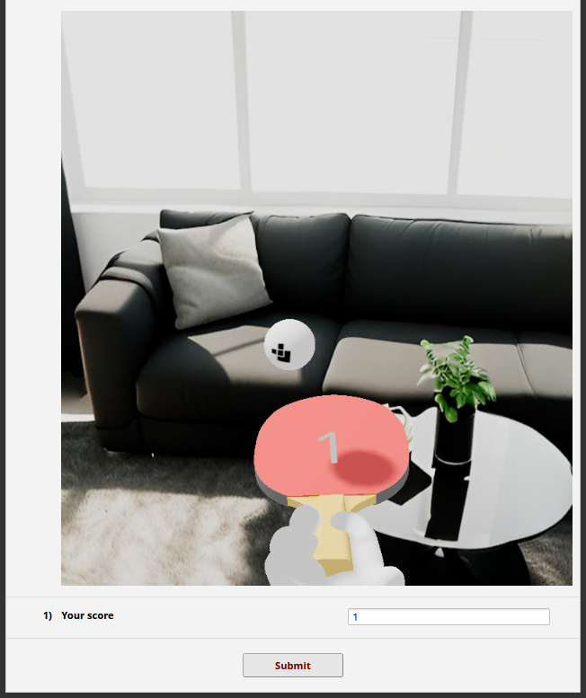

# "3D Ping Pong" Example *(Conflux Loader)*



*(a REDCap-ification of the [React Three Fiber 'Rapier Ping-pong'
example](https://r3f.docs.pmnd.rs/getting-started/examples))*

This example provides a simple 3D Ping Pong game, embeddable in a REDCap survey
or data entry form, and integrated with a text field that tracks the score.

This example was implemented using the React frontend framework along with the
'React Three Fiber' 3D library. Models are under the `resources` directory, and
are inlined during the build process.


### Setup

First, clone this repository and run the following:
```
npm install
npm run build
```

Next, establish a project with a 'Descriptive Text' field called `app`, and
configure Conflux Loader to load this React-enabled loader module.

Then, create a text field called `current_score`, which is where the game
reflects the current player score in a way that is easy to submit as part of a
REDCap instrument.

### Usage

To compile the JavaScript through Rollup, use:

```
npm run build
```

This will output the build under `public/bundle.js`. This path is referenced in
`loader_config.json`.
