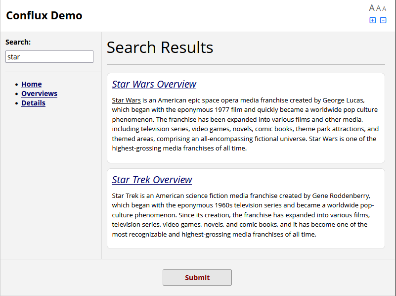

# "Information Browser" Example *(Conflux Loader)*



This example provides a simple static text content browser, embeddable in a
REDCap survey or data entry form, and includes a static content searching. This
example was implemented using the React frontend framework.

This was initially developed as a demo application for exhibiting Conflux at
REDCapCon 2024.

### Setup

First, clone this repository and run the following:
```
npm install
npm run build
```

Next, establish a project with a 'Descriptive Text' field called `app`, and
configure Conflux Loader to load this React-enabled loader module.

### Usage

To compile the JavaScript through Rollup, use:

```
npm run build
```

This will output the build under `public/bundle.js`. This path is referenced in
`loader_config.json`.
