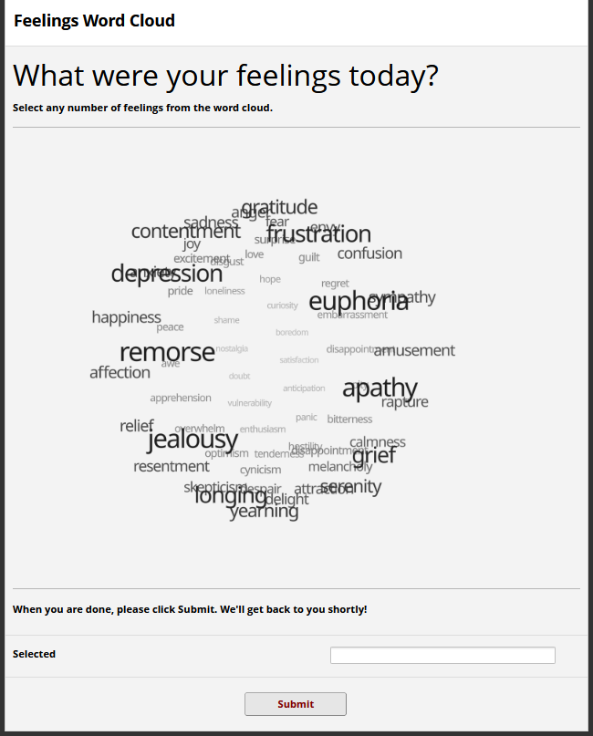

# "Word Cloud" Example *(Conflux Loader)*



*(a REDCap-ification of the [React Three Fiber 'Spherical word-cloud'
example](https://r3f.docs.pmnd.rs/getting-started/examples))*

This example provides a simple interactive field-like element that takes the
form of a clickable word cloud. This field is embeddable in a
REDCap survey or data entry form.

This example was implemented using the React frontend framework along with the
'React Three Fiber' 3D library.


### Setup

First, clone this repository and run the following:
```
npm install
npm run build
```

Next, establish a project with a 'Descriptive Text' field called `app`, and
configure Conflux Loader to load this React-enabled loader module.

### Usage

To compile the JavaScript through Rollup, use:

```
npm run build
```

This will output the build under `public/bundle.js`. This path is referenced in
`loader_config.json`.
